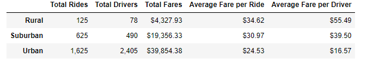
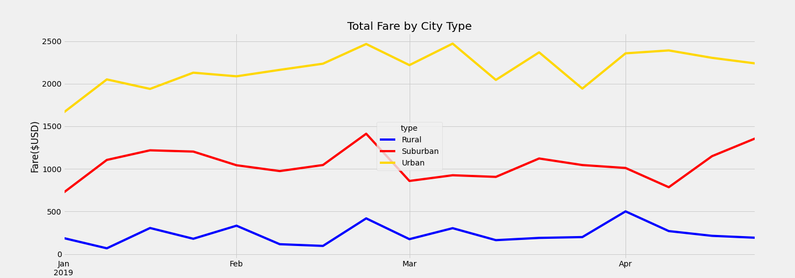
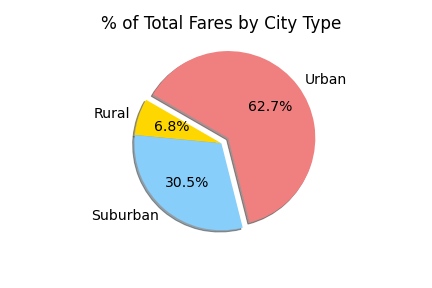

# PyBer_Analysis
Using matplotlib and pandas for the analysis of rideshare data.

## Overview
We use various graphs and charts to visualize trends in average fare, driver count, and ride count across different types of cities: urban, suburban, and rural.  This gives us some insight into the accessability and affordability of the rideshare service PyBer.

## Results

Above we see a dataframe describing the differences in rideshare activity between each type of city.
Rural is the least active type, with much less drivers and total rides.  However, compared to its urban and suburban counterparts, rural rides tend to cost more, and drivers are paid better on average.

These differences continue to grow as we move from suburban to urban cities as well: urban cities enjoy the greatest volume of drivers and rides, but the cheapest fare per ride and fare per driver.  To put it back into numbers, there were thirteen times as many urban rides as rural, but the average fare paid per driver in urban cities is a third of those paid in rural.

Looking at the line graph above, we can clearly see this trend in action.  Fare week-to-week is consistently highest in urban cities and lowest in rural.

## Summary

It seems PyBer is much more affordable and accessible in urban cities compared to other types of city.
These differences can be explained by the density of each city type.  If, for example, rides in the city tend to be much shorter than those in rural areas- possibly because places of interest in cities tend to be closer together- then the average fare would be much lower in urban cities.  Similarly, if population is more dense in cities, then both the raw number of total drivers and the number of rides would logically be highter than counts found in rural areas.  This means the fare per ride and fare per driver are both lower in urban cities, but the sheer volume of rides, in the end, cause urban city activity to comprise most of the total fares.  This point is illustrated in the pie chart below, which describes urban city fares as almost two-thirds of the volume of PyBer's total fares.

If we wanted to even these differences out, we could advertise the better pricing (that is, fare per driver) in suburban and rural areas.  This would incentivize drivers to do business in suburban and rural areas, reducing the differences in drivers, and therefore in average fare per driver, too.  However, this would mean more strain on drivers left in urban areas, and would not necessarily affect total rides or fares.  In fact, total rides and fares may be negatively impacted.

We could also offer location-based pricing, controlling the differences between the average fare per ride.  Higher fares in urban cities would reduce the differences in average fare per ride and per driver.  However, this would magnify the dominance urban cities have in total fares collected.  If this change also encourages an increase in driver count in these higher-fare (urban) areas, the differences in driver count may grow, as well.  On the other hand, less favorable pricing may discourage ridership, reducing differences in total rides.
